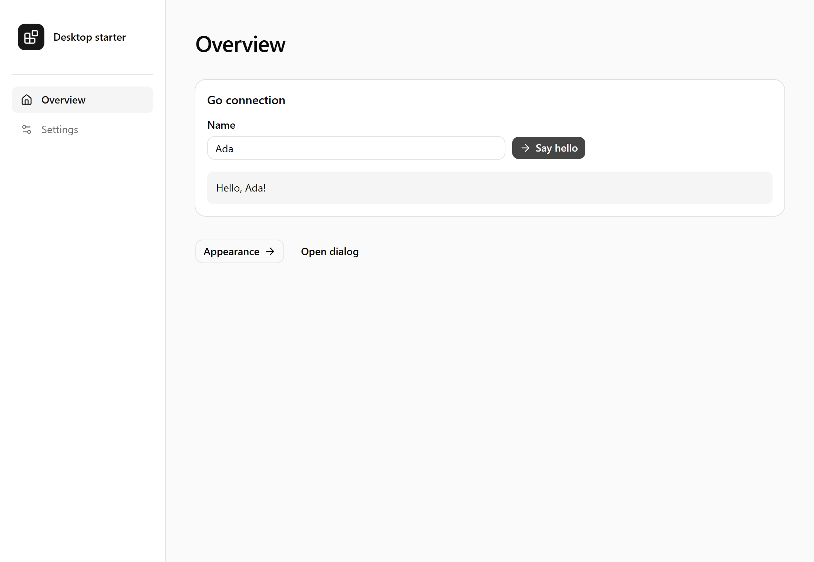

# Wails + React + TypeScript + shadcn/ui

A reusable **Wails v2 custom template** for desktop apps. It includes React 19, TypeScript, Vite 7, React Router 7, Tailwind CSS 4, and shadcn/ui with Base UI primitives.



## Create a new desktop app

Install the [prerequisites](#requirements), then generate an app directly from the repository URL. The commands below work in PowerShell or a macOS/Linux shell:

```powershell
wails init -n my-desktop-app -t https://github.com/benjaminraffetseder/wails-react-ts-shadcn-template
cd my-desktop-app
wails dev
```

To use a local checkout, clone the repository with Git and generate an app from the local template. Run these commands from the folder where you want both directories:

```powershell
git clone https://github.com/benjaminraffetseder/wails-react-ts-shadcn-template.git
wails init -n my-desktop-app -t ./wails-react-ts-shadcn-template
cd my-desktop-app
wails dev
```

A folder containing `template.json` is template source. A generated app contains `wails.json`; run development commands in that app folder. If you already have a checkout, skip `git clone` and run `wails init` from its parent folder.

On Linux with WebKitGTK 4.1, use `wails dev -tags webkit2_41` in place of `wails dev` in these examples. See [development and build commands](#develop-and-build-a-generated-app) for the matching build command.

You can also pass an absolute template path from anywhere:

```powershell
wails init -n my-desktop-app -t "C:/templates/wails-react-ts-shadcn-template"
```

Use a simple app name such as `my-desktop-app`. Wails sets the Go module, native window title, app name, and executable name during generation. The sidebar and browser title use the bundled translations; see [customization](#project-layout).

The repository's files are Wails template source. GitHub's **Use this template** button copies that source; use `wails init` to generate a runnable app.

## Requirements

- Go **1.25 or newer**
- Node.js **22.13 or newer in the 22.x line, or 24 or newer**, with npm
- Wails **v2 CLI** (template verified with **2.16.0**)
- Your platform's native Wails dependencies

Install the latest Wails v2 CLI:

```powershell
go install github.com/wailsapp/wails/v2/cmd/wails@latest
```

Add Go's binary directory to your `PATH` if it is not already there. This is `GOBIN` when configured, otherwise the `bin` directory under `go env GOPATH` (normally `%USERPROFILE%\go\bin` on Windows or `~/go/bin` on macOS/Linux). Reopen your terminal after changing its persistent PATH, then run `wails doctor`.

Windows needs WebView2; macOS needs Xcode command-line tools; Linux needs a C compiler, `pkg-config`, GTK 3, and WebKitGTK development libraries. Follow the [Wails installation guide](https://wails.io/docs/gettingstarted/installation/). If your Linux distribution uses WebKitGTK 4.1, pass `-tags webkit2_41` to both `wails dev` and `wails build`.

The template also requires a webview compatible with [Tailwind CSS 4's browser baseline](https://tailwindcss.com/docs/compatibility#browser-support): Chrome 111+, Safari 16.4+, or Firefox 128+ for browser previews. Use a current WebView2 runtime on Windows and a recent WebKit engine on macOS/Linux; Wails' minimum OS versions alone do not guarantee this CSS support.

## What is ready

- Shared app layout with active navigation and nested routes.
- Overview, settings, and a catch-all 404 screen.
- React Router `HashRouter`, which works with Wails asset serving.
- Official shadcn Button, Card, Input, Label, Badge, Dialog, and Separator source components using Base UI.
- Neutral design tokens with light, dark, and system themes. The theme persists in localStorage and follows system changes when selected.
- react-i18next localization with bundled English and German translations and a saved language selector.
- A Go `App.Greet` method and a typed React form with loading and error states.
- Browser preview that identifies itself and disables the native example when Go is unavailable.
- TypeScript and Vite aliases: `@/` for app source and `@wails/` for generated bindings.
- A committed npm lockfile for repeatable frontend installs.
- ESLint with TypeScript and React Hooks rules, plus Prettier formatting.

## Develop and build a generated app

Run these from the **generated app folder**:

```powershell
wails dev
```

`wails dev` generates the Go/TypeScript bindings and runs Vite with hot reload. Stop it with **Ctrl+C** before building:

```powershell
wails build
```

`wails build` builds the frontend and packages it with Go. Output is written under `build/bin/`: an `.exe` on Windows, an `.app` bundle on macOS, or an executable on Linux.

On Linux with WebKitGTK 4.1, use these commands instead, stopping development before building:

```bash
wails dev -tags webkit2_41
# Stop with Ctrl+C, then:
wails build -tags webkit2_41
```

After running `wails dev` or `wails build` at least once to generate bindings, stop any running Wails dev session before starting a separate Vite preview. Run frontend commands from the generated app:

```powershell
cd frontend
npm install
npm run typecheck
npm run lint
npm run format:check
npm run build
npm run dev
```

The last command previews the frontend in a browser. The greeting example requires `wails dev` or the packaged desktop app; plain Vite does not provide native methods.

Run `npm run lint:fix` to apply ESLint fixes and `npm run format` to format frontend source, configs, styles, and locale JSON. ESLint uses `eslint.config.js`; Prettier uses `.prettierrc.json` and `.prettierignore`. Generated Wails bindings, build output, and dependencies are excluded from both tools, and Prettier also skips the generated npm lockfile. ESLint reports code issues while Prettier owns formatting; `eslint-config-prettier` disables conflicting style rules. Lint warnings fail the check.

## Add shadcn components

Run inside the generated app's `frontend` folder:

```powershell
npm run ui:add -- switch dropdown-menu
```

This invokes the pinned shadcn CLI on demand and writes editable component source under `src/components/ui`. It requires internet access. The CLI is not installed as a permanent app dependency. Configuration lives in `components.json`; theme tokens live in `src/index.css`.

The `base-nova` style in `components.json` selects Base UI for newly added components. Compose primitives with Base UI's `render` prop, for example `<DialogTrigger render={<Button />}>Open</DialogTrigger>`. Style React Router links with `buttonVariants` so they retain link semantics.

## Project layout

In a generated app:

```text
app.go                          # Go methods exposed to React
main.go                         # Native window and asset server
go.mod / go.sum                 # Independent Go module
wails.json                      # Wails commands and app metadata
build/                          # Platform icons, manifests, packaging
frontend/
  components.json               # shadcn configuration
  eslint.config.js              # TypeScript and React Hooks lint rules
  .prettierrc.json / .prettierignore
  package.json / package-lock.json
  vite.config.ts
  src/
    app.tsx                     # HashRouter and route definitions
    main.tsx                    # React entry
    i18n/                       # Initialization, typed keys, bundled locale JSON
    index.css                   # Tailwind and light/dark tokens
    components/
      app-layout.tsx            # App shell and navigation
      theme-provider.tsx        # Saved/system theme
      ui/                       # Editable shadcn components
    lib/
      backend.ts                # Native availability and Go calls
      utils.ts                  # Shared class-name helper
    pages/                      # Overview, settings, 404
  wailsjs/                      # Generated by Wails; do not edit
```

Add a screen under `src/pages`, register it in `src/app.tsx`, and add a navigation item in `src/components/app-layout.tsx`. Add exported methods to Go's `App`; Wails regenerates typed bindings during development/build. Replace the greeting example once you add your app's features.

Customize `wails.json`, the native window title in `main.go`, and the icons under `build/` for each app. Set `app.title` in both `frontend/src/i18n/locales/en.json` and `de.json` to change the sidebar and browser title, and update the fallback `<title>` in `frontend/index.html`. The native window uses the standard system title bar and controls; its title is independent of the frontend language selector.

## Localization

Select **English** or **Deutsch** in Settings. The app uses the saved `desktop-language` preference first, then the first supported language in the webview's language list, with English as the fallback. Regional variants such as `de-AT` use German. The selection persists when localStorage is available; switching still works in memory when storage is blocked.

Translations are bundled under `frontend/src/i18n/locales/` and work offline. `src/i18n/index.ts` initializes i18next before React renders and updates the HTML language, text direction, and document title. Translation keys are typed from the English resource in `src/i18n/i18next.d.ts`.

Use [react-i18next's](https://react.i18next.com/latest/using-with-hooks) `useTranslation` in components:

```tsx
import { useTranslation } from "react-i18next"

export function OverviewHeading() {
  const { t } = useTranslation()
  return <h1>{t("nav.overview")}</h1>
}
```

Add a locale JSON file with the same keys, import it into `src/i18n/index.ts`, register it in `resources`, and add its code and native display name to `languages`. Missing translations fall back to English. Keep messages in the frontend: Go's `App.Greet` returns a typed `Greeting` object with a trimmed `name`, and React interpolates it into the localized greeting.

## Maintain the template

Files with `.tmpl` in their names are processed by `wails init`, which removes `.tmpl` from the generated filenames; ordinary frontend files are copied. Keep `frontend/package-lock.json` synchronized whenever dependencies change. Make dependency changes in a generated app, then copy its updated `package.json` and `package-lock.json` back to the template. Keep `node_modules`, `dist`, generated bindings, and built binaries out of the template source, since local template generation copies files even if Git ignores them.

This repository has no CI/CD pipelines or GitHub Actions workflows. Builds, linting, formatting checks, and template verification run manually on your machine. From a clean checkout, run the script for your platform after installing the prerequisites:

Windows (PowerShell 7):

```powershell
./scripts/verify-template.ps1
```

macOS or Linux (Bash, including the Bash shipped with macOS):

```bash
./scripts/verify-template.sh
```

The scripts validate Base UI dependencies, generate an app, build it for the current platform, run Go vet, TypeScript, ESLint, and Prettier checks, and verify the native executable. They print the generated app's temporary path and preserve it for inspection. Exercise navigation, the greeting, dialog keyboard controls, theme persistence, and English/German language switching and persistence with `wails dev` in that app.

On Linux, the Bash script uses `pkg-config` to detect WebKitGTK and prefers 4.1 when available, passing `webkit2_41` to both Wails and Go vet. Install GTK 3 and WebKitGTK development libraries as described in the [Wails installation guide](https://wails.io/docs/gettingstarted/installation/). To supply build tags explicitly:

```bash
WAILS_BUILD_TAGS=webkit2_41 ./scripts/verify-template.sh
```

Use the same tags for development in the generated app, for example `wails dev -tags webkit2_41`. On macOS, install Xcode command-line tools with `xcode-select --install`.

See [CONTRIBUTING.md](CONTRIBUTING.md) for contribution and verification steps.

## License

MIT; see [LICENSE](LICENSE). Copied shadcn components retain their upstream copyright and MIT license in [THIRD_PARTY_NOTICES.md](THIRD_PARTY_NOTICES.md). Keep these notices with redistributed template code. For your own app, add your application's copyright and licensing without removing upstream notices.

## Wails 2.16 browser development limitation

The browser endpoint served by `wails dev` can emit `Cannot read properties of null (reading 'nodes')` from Wails' injected `/wails/ipc.js`. Verification traced this to the framework's development reconnect overlay initializing its Svelte component. The Go bridge and app interactions still work. Plain Vite preview and production assets do not include this overlay. No framework patch or console-error suppression is included in this template.

References: [Wails custom templates](https://v2.wails.io/docs/guides/templates/), [Wails routing](https://wails.io/docs/guides/routing/), [shadcn Vite setup](https://ui.shadcn.com/docs/installation/vite).
